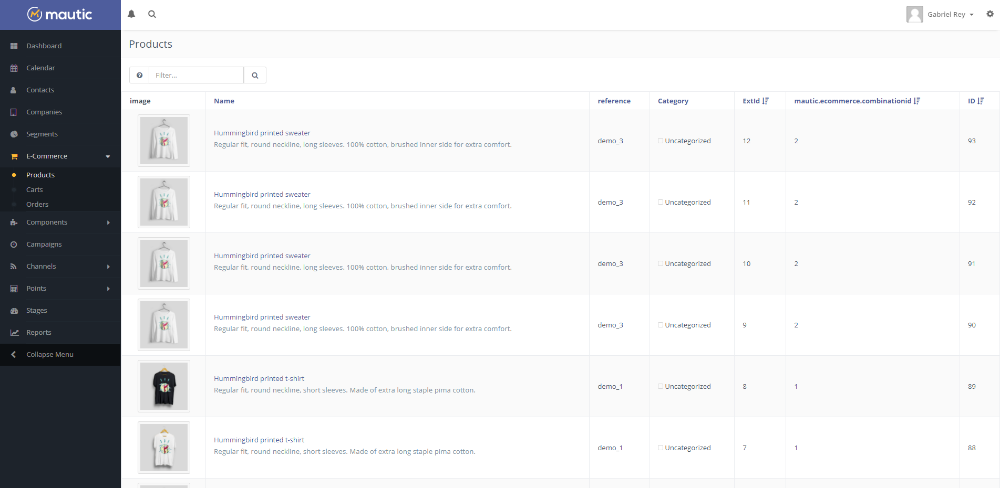
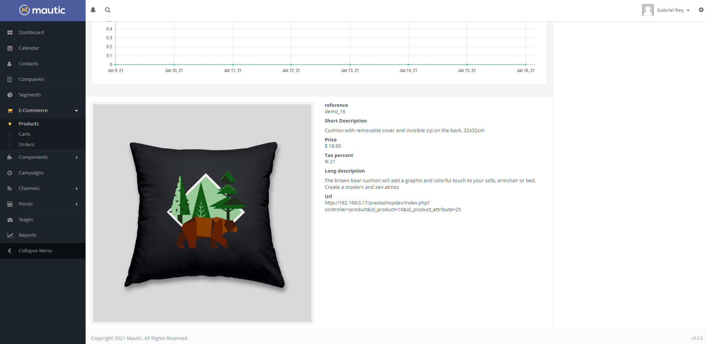
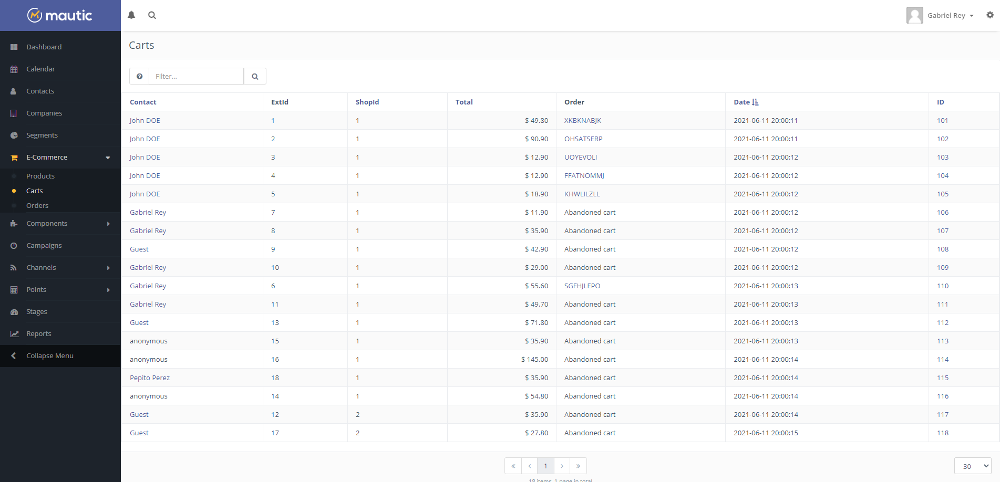
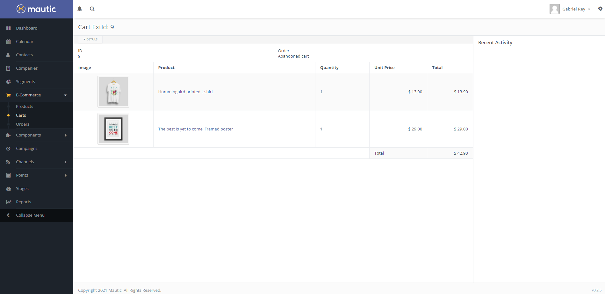
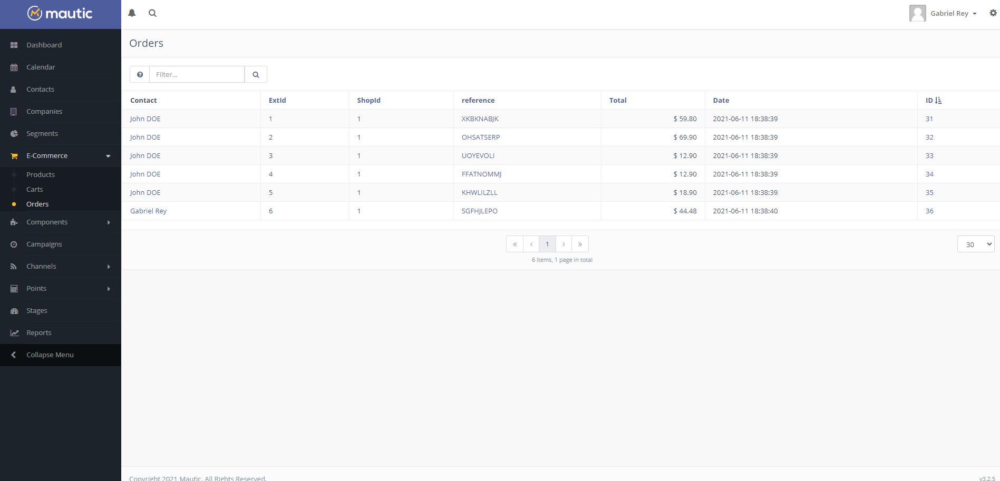
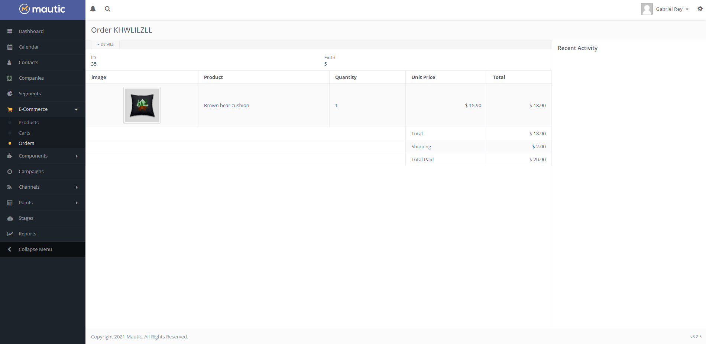

# EcommerceBundle
Ecommerce for Mautic 3

Work in progress. Do not use in production

This Bunde add entities to mautic for use in e-commerce 
Customer fields to relation with an external e-commerce (Customer Id - Guest Id) 
Override PgeModel HitPage to include product viewed 

###Products

###Carts

###Orders

